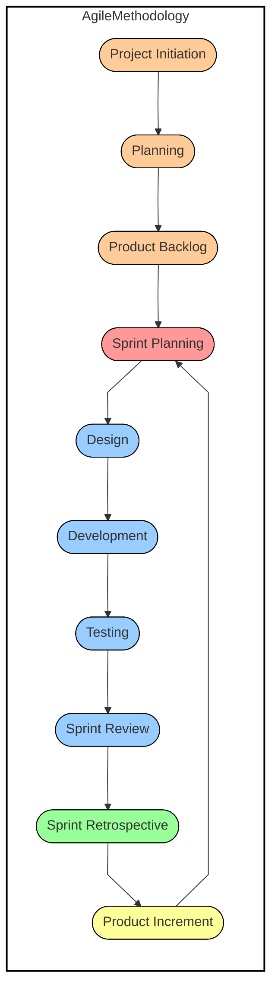
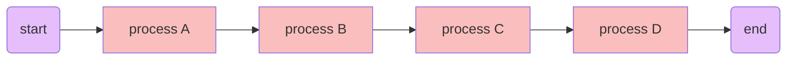
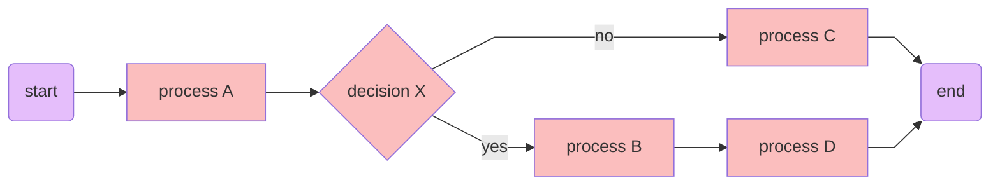
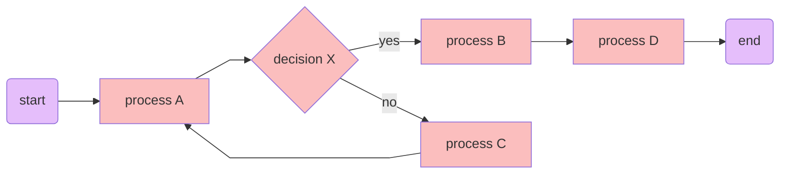
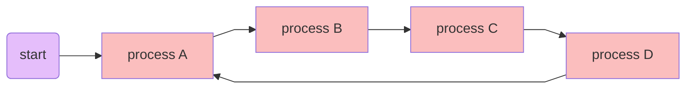

# DirectoryStructures305

Welcome to **DirectoryStructures305**! This repository showcases an innovative approach to representing workflows, procedures, and models using directory structures and shortcuts. By aligning folders with processes, decisions, and components of models, these structures mirror how we work and what we work on, providing a clear and organized view of complex systems. .lnk files represent relationships between different elements, offering a structured and interactive way to navigate these systems.

It's important to recognize that while these directory structures offer a starting point, they may not fit every individual or organizational need. Customization may be necessary to tailor the structures to your specific requirements, as there is no one-size-fits-all solution. If you need assistance with customizing these directory structures for your needs, feel free to contact me.

# Workflows Overview

The repository includes multiple examples to illustrate different workflow representation strategies:

| Workflow Type | Description |
| :------------------------- | :---------------------------------------------------------- |
| **Simple Linear Workflow** | A straightforward linear workflow from start to finish. |
| **Conditional Workflow** | A workflow with conditional branching, guiding the process based on specific conditions. |
| **Decision-Based Workflow** | A decision-based workflow with conditional logic leading to different paths. |
| **Cyclical Workflow** | A cyclical workflow that loops back to the beginning, creating a repeating process. |


## Workflow 1 (Simple Linear Workflow): 

**Flowchart:**


**Flowchart by Mermaid:**


**Directory Structure based on the flowchart:**
```plaintext
Workflows
└───Simple Linear Workflow
    ├───start
    │   └───goto process A.lnk
    ├───process A
    │   └───goto process B.lnk
    ├───process B
    │   └───goto process C.lnk
    ├───process C
    │   └───goto process D.lnk
    ├───process D
    │   └───goto end.lnk
    └───end
```

## Workflow 2 (Conditional Workflow):

**Flowchart:**


**Flowchart by Mermaid:**


**Directory Structure based on the flowchart:**
```plaintext
Workflows
└───Conditional Workflow
    ├───start
    │   └───goto process A.lnk
    ├───process A
    │   └───goto decision X.lnk
    ├───decision X
    │   ├───goto process B if x is true.lnk
    │   └───goto process C if x is false.lnk
    ├───process B
    │   └───goto process D.lnk
    ├───process C
    │   └───goto end.lnk
    ├───process D
    │   └───goto end.lnk
    └───end

```

## Workflow 3 (Decision-Based Workflow):

**Flowchart:**


**Flowchart by Mermaid:**


**Directory Structure based on the flowchart:**
```plaintext
Workflows
└───Decision-Based Workflow
    ├───start
    │   └───goto process A.lnk
    ├───process A
    │   └───goto decision X.lnk
    ├───decision X
    │   ├───goto process B if x is true.lnk
    │   └───goto process C if x is false.lnk
    ├───process B
    │   └───goto process D.lnk
    ├───process C
    │   └───goto process A.lnk
    ├───process D
    │   └───goto end.lnk
    └───end
```

## Workflow 4 (Cyclical Workflow):

**Flowchart:**


**Flowchart by Mermaid:**


**Directory Structure based on the flowchart:**
```plaintext
Workflows
└───Cyclical Workflow
    ├───start
    │   └───goto process A.lnk
    ├───process A
    │   └───goto process B.lnk
    ├───process B
    │   └───goto process C.lnk
    ├───process C
    │   └───goto process D.lnk
    └───process D
        └───goto process A.lnk
```
# Learn More

1. [Video: Organize Your Files](https://datamanagement.hms.harvard.edu/plan-design/directory-structure)
2. [Blog: Directory Structure](https://dpbestflow.org/file-management/directory-structure)
3. [Research Data Management - File Organization](https://guides.nyu.edu/data_management/file-org)
4. [Directory Structures for researchers, with examples](https://ubco-biology.github.io/Procedures-and-Guidelines/directory-structures.html)
